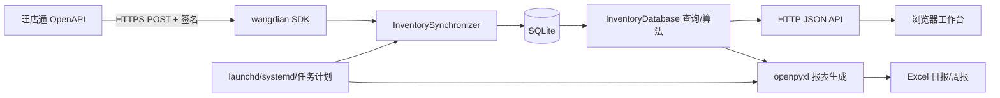

# 旺店通库存、运营与采购日报系统——技术交接文档

> 文档版本：1.0
> 交接基准日期：2026-09-02
> 项目目录：`/Users/tmt/wangyewangdian`
> Git 仓库：`https://github.com/chengc1116/wangdiantong_web.git`
> 当前分支：`main`
> 当前已提交版本：`b0c0b5f`（`add the quick start`）

---

## 0. 阅读说明

本文面向接手开发、部署、数据维护和故障处理的技术人员，目标是使接手人能够独立完成：

1. 理解系统用途、边界和数据口径；
2. 在新电脑或服务器安装并启动系统；
3. 配置旺店通 OpenAPI 凭证；
4. 执行日常同步、历史补数和报表导出；
5. 维护 SQLite 数据库并进行备份恢复；
6. 定位同步失败、网页异常、报表为空等问题；
7. 安全修改采购、预警、调拨和报表算法；
8. 识别当前环境中尚未解决的风险和待办事项。

本文不记录任何真实 SID、App Key 或 App Secret。凭证必须通过线下安全方式单独交接。

---

## 1. 项目概述

### 1.1 系统解决的问题

本系统从旺店通正式 OpenAPI 拉取商品、仓库、库存、销售出库、退货入库、取消订单和出入库流水，写入本地 SQLite，并在此基础上提供：

- 浏览器库存工作台；
- 库存、可用库存、采购在途和库存金额概览；
- 仓库 + SKU 粒度的销售、退货、净销量分析；
- 店铺 + SKU 粒度的销售分析；
- 商品简称汇总；
- 入库类型分析；
- 库存预警、积压识别和清仓跟踪；
- 五个运营仓的采购计划；
- 仓间调拨建议；
- 每日和每周 Excel 报表；
- Windows、Linux、macOS 定时同步；
- 可独立使用的旺店通 Python SDK；
- 面向业务人员和二开程序的只读 FastAPI 数据服务。

### 1.2 当前技术形态

| 层次 | 当前实现 |
| --- | --- |
| 后端语言 | Python 3.9+，当前本机虚拟环境为 Python 3.12 |
| HTTP 服务 | 现有网页使用 Python 标准库 `ThreadingHTTPServer`；新增公网只读数据 API 使用 FastAPI + Uvicorn |
| 前端 | 原生 HTML、CSS、JavaScript，无构建步骤 |
| 数据库 | SQLite，WAL 模式 |
| Excel | `openpyxl` |
| 旺店通请求 | `requests` |
| Python 包管理 | `pyproject.toml` + setuptools |
| 网页启动包装 | `npm start` 实际调用 Bash 脚本，Node.js 不是业务运行依赖 |
| 自动任务 | macOS launchd、Linux systemd user timer、Windows 任务计划程序 |
| 测试 | Python `unittest` |

### 1.3 只读 FastAPI 数据服务边界

- API 入口：`src/wangdian_inventory/api.py`。
- 主查询接口：`POST /api/v1/query`；数据集、字段、筛选、分组、聚合和分页均经过白名单校验，不接受任意 SQL。
- 数据库连接：`ReadOnlyDatabase` 使用 SQLite URI `mode=ro`，API 不执行建表、迁移、同步或写入。
- 云端同步：由原有每日任务负责，API 只读取同步任务更新后的同一个 `inventory_production.db`。
- 公网要求：按业务要求可不登录、所有人可读，但必须通过 HTTPS/反向代理发布；不要直接暴露 SQLite 文件或让 Uvicorn 监听公网网卡。
- 详细字段、请求体、systemd 和 Nginx 配置见 [数据库只读 FastAPI 服务说明](数据库只读%20FastAPI%20服务说明.md)。

### 1.3 重要业务边界

- 主要计算粒度是“仓库 + SKU”。
- 采购计划只计算以下五个运营仓：
  - 主仓库（新）
  - TMT康复仓
  - 杰菲克德国仓
  - 日本仓
  - ENYISA仓
- 清仓款不进入正常采购计划。
- 当前库存是执行同步时的实时快照；历史销售、退货和流水按业务日期保存。
- 历史补同步某一天时，库存快照仍可能是执行补同步当天查询到的当前库存，不能误认为是历史时点库存。
- 系统只提供决策建议，不会自动向旺店通创建采购单、调拨单或修改商品结构。

---

## 2. 当前交接状态快照

本节记录 2026-09-02 实际检查结果。接手后应首先重新核对。

### 2.1 代码状态

当前 Git 工作区不是干净状态，存在尚未提交的算法和文档修改：

```text
M  README.md
M  docs/purchase-planning-rules.md
M  src/wangdian_inventory/db.py
M  src/wangdian_inventory/report_export.py
M  tests/test_inventory_app.py
?? docs/algorithm-change-priorities.md
?? tests/test_purchase_rules.py
```

交接注意：

- 不要直接执行 `git reset --hard`、`git checkout .` 或覆盖上述文件。
- 这些改动主要涉及采购预测、采购数量、固定下单日和测试。
- 在继续开发前，建议先审阅差异并形成一个明确提交。
- 本文档和非技术版文档也是新文件，需要纳入后续提交。

查看差异：

```bash
git status --short
git diff --stat
git diff
```

### 2.2 自动化测试状态

2026-09-02 在当前工作区执行：

```bash
PYTHONPATH=src .venv/bin/python -m unittest discover -s tests -p 'test_*.py' -q
```

结果：

```text
Ran 68 tests
OK
```

这说明当前工作区已有测试全部通过，但不等于生产数据和外部 API 一定正常。

### 2.3 本机数据库状态

本机正式库：

```text
data/inventory_production.db
```

检查时状态：

| 项目 | 数值 |
| --- | ---: |
| 数据库大小 | 1,503,260,672 字节，约 1.40 GiB |
| 商品数 | 9,104 |
| 当前库存行 | 63,686 |
| 库存历史快照行 | 1,398,353 |
| 出入库流水行 | 531,222 |
| 销售明细行 | 217,770 |
| 退货明细行 | 3,235 |
| 清仓周快照行 | 32,893 |
| 仓库数 | 52 |
| 同步任务记录 | 71 |
| SQLite `quick_check` | `ok` |
| 本机最后成功业务日期 | 2026-08-23 |
| 本机最后成功完成时间 | 2026-08-24 10:35:25 |

本机库相对 2026-09-02 已明显落后，不能直接当作最新业务数据。

### 2.4 当前观察到的两个运行环境

当前电脑上观察到两个不同数据来源：

1. `http://127.0.0.1:5050/api/status`
   - 返回本机数据库路径 `/Users/tmt/wangyewangdian/data/inventory_production.db`；
   - 最后成功同步业务日期为 2026-08-23。
2. `http://127.0.0.1:5052/api/status`
   - 返回数据库路径 `/home/ecs-user/wangdiantong_web/data/inventory_production.db`；
   - 最后成功同步业务日期为 2026-09-01；
   - 完成时间为 2026-09-02 01:30:16；
   - 说明 5052 当前很可能经过编辑器端口转发访问 Linux 服务器。

同时本机 launchd 也在尝试监听 `0.0.0.0:5052`，并且进程列表中还有编辑器端口转发进程监听 `127.0.0.1:5052`。这会导致“访问 5052 时到底连接本机还是服务器”的判断混乱。

接手后建议：

- 给本机开发服务固定使用 5050 或 5053；
- 给远程端口转发保留 5052；
- 每次操作前先访问 `/api/status` 核对返回的 `database` 和 `last_sync`；
- 不要仅凭浏览器地址判断当前操作的是哪个环境。

### 2.5 本机 launchd 状态

- `com.wangdian.inventory-web`：已加载且正在运行；
- `com.wangdian.inventory-daily`：plist 文件存在，但 `launchctl list` 中未加载；
- 已安装的 daily plist 仍使用 `--daily-sync`；
- 仓库内新版 plist 使用 `--daily-job`，会在同步后额外生成 Excel 日报；
- 本机 `daily-sync.log` 最后修改时间为 2026-08-20；
- `daily-sync-error.log` 最后修改时间为 2026-08-24；
- 因此本机每日任务当前不能视为正常运行。

### 2.6 已发现的明确问题

1. `package.json` 中存在：

   ```json
   "daily-job": "bash scripts/run-daily-job.sh"
   ```

   但仓库中没有 `scripts/run-daily-job.sh`，所以 `npm run daily-job` 当前会失败。
2. 本机 daily launchd 没有加载，且已安装版本和仓库模板不一致。
3. 本机数据库停留在 2026-08-23，不能用于最新运营判断。
4. 现有网页监听 `0.0.0.0` 时没有登录认证和 HTTPS，不能直接暴露到公网；只读 FastAPI API 也必须经过 HTTPS/反向代理后再公网发布。
5. `/api/sync` 没有鉴权，任何能访问网页端口的人都可能触发同步。
6. 同步互斥锁是进程内 `threading.Lock`，不能阻止两个独立 Python 进程同时同步同一个数据库。
7. 旺店通请求有限速，但没有通用自动重试；历史日志中出现过频率超限和远端断开。
8. 报表导出较大，用户取消下载时会产生 `BrokenPipeError` 日志；通常不代表数据库损坏。

---

## 3. 项目目录与职责

```text
wangyewangdian/
├── src/
│   ├── wangdian/                   # 独立旺店通 OpenAPI SDK
│   │   ├── client.py               # 请求、环境、限速、参数序列化
│   │   ├── signing.py              # 旺店通 MD5 签名算法
│   │   └── exceptions.py           # SDK 异常类型
│   └── wangdian_inventory/
│       ├── app.py                  # HTTP 路由、CLI、日报任务入口
│       ├── config.py               # 凭证和数据库配置加载
│       ├── sync.py                 # 旺店通数据同步编排
│       ├── db.py                   # 表结构、写入、分析和算法
│       ├── report_export.py        # Excel 日报/周报生成
│       ├── templates/index.html    # 单页网页结构
│       └── static/
│           ├── app.js              # 页面状态、请求、表格和图表
│           └── app.css             # 页面样式
├── data/                            # 正式库、日志和中间数据；Git 忽略
├── outputs/                         # Excel 输出；Git 忽略
├── docs/
│   ├── purchase-planning-rules.md  # 当前采购算法口径
│   ├── algorithm-change-priorities.md # 下一阶段算法改造建议
│   └── 项目交接文档-*.md
├── deploy/
│   ├── macos/                      # launchd 模板
│   ├── linux/                      # systemd 模板
│   ├── windows/                    # Windows 计划任务脚本
│   └── sql/                        # 一次性数据库迁移 SQL
├── examples/                        # API 查询、资料导入、退款核对工具
├── scripts/                         # 运维辅助脚本
├── tests/                           # 单元测试和接口核对样本
├── README.md                        # 安装和运行说明
├── pyproject.toml                   # Python 包元数据和依赖
├── package.json                     # npm 启动包装
├── wangdian_config.example.py       # 凭证模板
└── wangdian_config.py               # 本地真实凭证；Git 忽略，禁止提交
```

### 3.1 不属于业务备份的数据

以下内容可重建，不应作为核心业务备份：

- `.venv/`
- `__pycache__/`
- `*.pyc`
- `.pytest_cache/`
- `build/`
- `dist/`
- `outputs/`

### 3.2 必须单独保护的数据

- `data/inventory_production.db`
- 生产环境实际数据库文件
- `wangdian_config.py` 或服务器环境变量
- 服务器部署配置
- 业务确认后的采购规则文档
- 必要时保留 `data/*.log` 作为故障证据

`data/*.db-wal` 和 `data/*.db-shm` 是 SQLite 运行文件，不能在数据库正在使用时直接删除。

---

## 4. 系统架构与数据流

### 4.1 总体架构



### 4.2 一次完整每日任务

`--daily-job` 默认处理“昨天”：

1. 创建 `sync_runs` 记录，状态为 `running`；
2. 查询出入库流水 `stockinout_order_query.php`；
3. 查询销售出库 `stockout_order_query_trade.php`；
4. 查询取消订单并修正销售状态；
5. 查询退货入库；
6. 查询当日修改商品资料；
7. 刷新全部当前库存；
8. 如执行当天为周一，保存清仓周快照；
9. 将 `sync_runs` 标记为 `success` 或 `failed`；
10. 生成指定业务日期的每日 Excel；
11. 保存到 `outputs/daily-report-YYYY-MM-DD/`。

### 4.3 同步幂等性

多数明细使用业务字段或哈希形成主键，并通过 upsert 写入，因此同一日期重复同步通常不会简单重复累加。

但需注意：

- 重复同步仍会重新请求旺店通，耗时且消耗接口频率；
- 商品和库存是覆盖/更新逻辑；
- 当前库存表会整体替换；
- `sync_runs` 每次都会新增一条记录；
- 多进程同时执行仍可能造成锁竞争或口径混乱。

---

## 5. 配置与凭证

### 5.1 配置读取优先级

`src/wangdian_inventory/config.py` 的读取顺序：

1. 环境变量；
2. 项目根目录 `wangdian_config.py`；
3. 兼容旧路径 `examples/wangdian_config.py`；
4. 默认值。

支持的环境变量：

| 环境变量 | 配置文件字段 | 说明 |
| --- | --- | --- |
| `WDT_SID` | `SID` | 旺店通卖家账号 |
| `WDT_APP_KEY` | `APP_KEY` | 接口账号 |
| `WDT_APP_SECRET` | `APP_SECRET` | 接口密钥 |
| `WDT_ENV` | `ENVIRONMENT` | `production` / `test` |
| `WDT_DATABASE` | `DATABASE` | SQLite 绝对路径 |
| `WDT_DEMO_DATA` | 无 | 无凭证时是否启用演示数据，默认 `1` |

### 5.2 正式配置模板

```python
SID = "..."
APP_KEY = "..."
APP_SECRET = "..."
ENVIRONMENT = "production"
DATABASE = "/absolute/path/to/data/inventory_production.db"  # 可选
```

安全要求：

```bash
chmod 600 wangdian_config.py
```

禁止：

- 提交到 Git；
- 粘贴到工单、群聊或截图；
- 将生产密钥写进 plist、前端 JS 或 README；
- 在错误日志中打印完整请求签名参数。

### 5.3 演示模式

当没有完整凭证，且 `WDT_DEMO_DATA` 未设为 `0` 时：

- `demo_mode = true`；
- 使用 `data/inventory_demo.db`；
- 自动写入演示数据；
- 同步接口会拒绝真实同步。

正式环境必须检查：

```bash
curl http://127.0.0.1:PORT/api/status
```

应满足：

```json
{
  "configured": true,
  "demo_mode": false,
  "environment": "production"
}
```

还必须检查 `database` 路径确实指向目标服务器或目标本机。

---

## 6. 安装、启动与停止

### 6.1 macOS / Linux 安装

```bash
cd /path/to/wangyewangdian
python3 -m venv .venv
source .venv/bin/activate
python -m pip install --upgrade pip
python -m pip install -e .
```

依赖只有：

- `requests>=2.28,<3`
- `openpyxl>=3.1,<4`

### 6.2 Windows 安装

```powershell
cd C:\path\to\wangyewangdian
py -3.12 -m venv .venv
.\.venv\Scripts\Activate.ps1
python -m pip install --upgrade pip
python -m pip install -e .
```

### 6.3 开发启动

仅本机访问：

```bash
PYTHONPATH=src .venv/bin/python -m wangdian_inventory.app \
  --host 127.0.0.1 --port 5050 --no-browser
```

局域网访问：

```bash
PYTHONPATH=src .venv/bin/python -m wangdian_inventory.app \
  --lan --port 5052 --no-browser
```

或：

```bash
npm start
```

`npm start` 只是执行 `scripts/start-web.sh`，不需要前端依赖安装或打包。

### 6.4 停止开发服务

前台启动时按 `Ctrl+C`。

后台进程需先确认 PID：

```bash
lsof -nP -iTCP:5050 -sTCP:LISTEN
kill <PID>
```

不要使用不加筛选的 `pkill python`。

### 6.5 CLI 参数

```text
--host HOST
--port PORT
--lan
--sync YYYY-MM-DD
--backfill-shop-sales START_DATE END_DATE
--daily-sync
--daily-job
--inventory-sync
--no-browser
```

主要区别：

| 参数 | 作用 |
| --- | --- |
| `--sync DATE` | 完整同步指定日期并退出 |
| `--daily-sync` | 完整同步昨天并退出 |
| `--daily-job` | 完整同步昨天、生成日报并退出 |
| `--inventory-sync` | 只刷新当前库存 |
| `--backfill-shop-sales` | 补齐销售明细中的店铺维度 |

---

## 7. 旺店通 SDK

### 7.1 网关环境

`src/wangdian/client.py` 定义：

- 正式：`https://openapi.huice.com/openapi`
- 测试：`https://openapi.ali.huice.cc/openapi`

调用时 endpoint 会自动补 `.php`。

### 7.2 签名流程

1. 将公共参数和业务参数序列化为字符串；
2. 按参数名排序；
3. 使用“键长度-键:值长度-值”格式拼接；
4. 拼接 App Secret；
5. 计算小写 MD5。

实现位于：

```text
src/wangdian/signing.py
```

签名算法有独立单元测试，修改前必须先阅读 `tests/test_signing.py`。

### 7.3 限速和超时

同步器创建客户端时使用：

- 连接超时 10 秒；
- 读取超时 60 秒；
- 每分钟最多 50 次请求；
- 旺店通免费接口限制备注为每分钟 60 次，代码主动留出余量。

当前没有统一指数退避或失败自动重试。遇到以下错误时任务会失败并写入 `sync_runs`：

- HTTP/网络错误 → `TransportError`；
- 非 JSON 响应 → `ResponseDecodeError`；
- 旺店通业务码非 0 → `ApiError`。

### 7.4 同步使用的主要接口

| 数据 | endpoint |
| --- | --- |
| 商品 | `goods_query` |
| 仓库 | `warehouse_query` |
| 出入库流水 | `stockinout_order_query` |
| 销售出库 | `stockout_order_query_trade` |
| 退货入库 | `stockin_order_query_refund` |
| 取消订单 | `stockout_order_query_trade_cancel` |
| 当前库存 | `stock_query` |

接口结果字段和分页参数依赖旺店通 OpenAPI，调整前应使用 `examples/` 中脚本做小范围验证。

---

## 8. 数据同步逻辑

### 8.1 全量起点

`InventorySynchronizer.INITIAL_INVENTORY_START` 当前固定为：

```text
2026-07-01 00:00:00
```

这是 MVP 初始化范围，不代表旺店通完整历史。若要扩展到 2026-07-01 之前，需评估 API 时间窗口、数据库容量和执行时长。

### 8.2 分页策略

- 页码从 0 开始；
- 最多 10,000 页；
- 根据空页、页大小或 `total_count` 结束；
- 超过安全页数会抛出异常。

### 8.3 商品同步

- 新库没有 SKU 时，商品同步会先跳过；
- 初始 SKU 通常由流水写入商品占位行；
- 再通过 `goods_query` 完善商品字段；
- 商品级备注和规格级备注分开保存；
- 旺店通 `prop` 字段被映射为采购价、生产周期、产品结构、产线、日产能等业务属性；
- 映射属于强业务约定，旺店通字段配置改变时必须同步修改代码和文档。

### 8.4 库存同步

正常情况下：

- 先读取数据库全部 SKU；
- 每 200 个 SKU 一组请求 `stock_query`；
- 收集全部记录后替换 `inventory_current`；
- 同时写入当天 `inventory_snapshots`。

新库或强制全量时：

- 从 2026-07-01 起按约 30 天窗口扫描到当前时间；
- 完成后整体替换当前库存。

### 8.5 销售、退货和取消

- 销售按出库/发货业务日期写入 `sales_lines`；
- 退货按退货入库日期写入 `return_lines`；
- 取消接口用于更新已有销售明细状态；
- 店铺维度依赖销售出库接口中的 shop 字段；
- 历史店铺信息不足时使用 `--backfill-shop-sales`。

### 8.6 清仓周快照

代码在“执行当天为周一”时记录清仓周快照。注意判断依据是 `date.today()`，不是被补同步的业务日期。

这意味着：

- 周一补同步旧日期仍会记录本周快照；
- 非周一补同步某个历史周一不会补出对应历史周快照。

如业务要求按业务日期生成，应修改该逻辑并补测试。

---

## 9. 数据库设计

### 9.1 连接设置

每次连接：

```sql
PRAGMA foreign_keys = ON;
PRAGMA journal_mode = WAL;
```

目前表之间没有大量显式外键约束，数据关联主要依赖 `sku_no`、`warehouse_id`、业务单号和明细号。

### 9.2 核心表

#### `products`

商品/SKU 主数据，一行一个 `sku_no`。包含：

- 货品编号、名称、简称、规格、条码；
- 零售价、批发价、采购价、ERP 价格；
- 类目、产品结构；
- 供应商；
- 最低起订量；
- 生产天数、产线、日产能；
- 货品备注和规格备注；
- 原始 JSON。

#### `warehouse_master`

仓库主数据，包含：

- 仓库名称和编号；
- 是否停用；
- 仓库角色；
- 是否允许作为调拨来源；
- 原始 JSON。

#### `inventory_current`

当前库存，一行一个 `sku_no + warehouse_id`：

- 实际库存；
- 可用库存；
- 成本价、平均成本价；
- 采购在途；
- 同步时间；
- 原始 JSON。

#### `inventory_snapshots`

每日库存快照，一行一个 `snapshot_date + sku_no + warehouse_id`。是数据库增长最快的表之一。

#### `movements`

出入库流水：

- 业务日期和时间；
- 仓库、SKU；
- 出入库类型；
- 入库量、出库量、净数量；
- 来源单号和明细号；
- 原始 JSON。

#### `sales_lines`

销售出库明细：

- 销售/发货日期；
- 仓库和店铺；
- SKU、数量、金额、成本；
- 订单/明细标识；
- 状态；
- 原始 JSON。

#### `return_lines`

退货入库明细：

- 退货日期和入库时间；
- 仓库、SKU；
- 数量、退款金额、成本；
- 来源订单和明细；
- 状态；
- 原始 JSON。

#### `clearance_weekly_snapshots`

清仓 SKU 周度库存和资金占用快照。

#### `sync_runs`

每次同步的审计表：

- 同步业务日期；
- 状态；
- 各类记录数；
- 开始/结束时间；
- 错误信息。

### 9.3 自动迁移机制

`InventoryDatabase.initialize()` 在启动时执行：

- `CREATE TABLE IF NOT EXISTS`；
- 检查缺失字段；
- 通过 `ALTER TABLE` 增加部分新字段；
- 修正部分历史仓库角色和业务数据。

此外存在一次性 SQL：

```text
deploy/sql/20260826_separate_goods_spec_remark.sql
```

执行前必须备份，并确认字段是否已存在，不能重复执行其中的 `ALTER TABLE`。

目前没有 Alembic 等正式迁移版本管理。后续增加字段时建议：

1. 保持初始化兼容旧库；
2. 增加独立迁移脚本；
3. 记录迁移日期、前置版本和回滚方案；
4. 在测试临时库和生产备份副本上先执行。

### 9.4 数据增长

README 记录当前增长约 24–27 MB/天，约 0.75 GB/月，主要来自原始 JSON 和每日库存快照。

优化方向：

- 原始 JSON 冷归档或压缩；
- 对历史 `inventory_snapshots` 做月度归档；
- 保留业务字段，减少重复原文；
- 增加容量告警；
- 不要在未验证报表口径前直接删除历史行。

---

## 10. 业务算法与计算口径

采购算法的权威说明优先查看：

```text
docs/purchase-planning-rules.md
```

算法后续改造优先级查看：

```text
docs/algorithm-change-priorities.md
```

### 10.1 销量预测

有完整 30 日历史时：

```text
7日日均 = 近7日销量 ÷ 7
30日日均 = 近30日销量 ÷ 30
预测日销量 = 7日日均 × 40% + 30日日均 × 60%
```

历史不足时，依次退化使用 7 日、3 日或有效日期平均。

当前已知不足：缺货日可能被当成零销量，导致需求预测偏低。改进要求已记录在算法优先级文档。

### 10.2 趋势系数与采购倍率

趋势系数：

```text
趋势系数 = 近7日日均 ÷ 近30日日均
```

当前工作区中的采购倍率：

| 趋势系数 | 采购倍率 |
| ---: | ---: |
| `< 0.5` | 0.5 |
| `0.5–<0.8` | 0.6 |
| `0.8–<1.2` | 1.0 |
| `1.2–<1.8` | 1.2 |
| `>=1.8` | 1.4 |

趋势倍率只作用于采购目标量，不二次放大预测日销量。

### 10.3 库存覆盖

```text
供给量 = 可用库存 + 采购在途
含在途覆盖天数 = 供给量 ÷ 预测日销量
```

当前规则中，可用库存、采购在途和调拨建议影响缺货风险、预计缺货日期和下单时间，但不扣减采购目标数量。

### 10.4 采购目标量

令 `A = 近7日销量总量`：

| 生产周期 | 目标库存 |
| ---: | ---: |
| 15–20 天 | `4A` |
| 25 天 | `7A` |
| 30 天及其他已配置周期 | `8A` |

```text
采购目标量 = 目标库存 × 趋势倍率
```

当前工作区尚未提交的改动明确采用“目标库存直接作为采购量基础”，不扣减可用库存、采购在途或建议调拨。

### 10.5 起订量和取整

- 配置了起订量：使用配置值；
- 未配置：默认 100；
- 明确配置“无”：不强制 100；
- 低于最低起订量：补足到起订量；
- 达到起订量后按 50 件倍数处理；
- 余数 1–10 向下，11–49 向上。

示例：

| 计算量 | 建议量 |
| ---: | ---: |
| 103 | 100 |
| 109 | 100 |
| 111 | 150 |
| 238 | 250 |

### 10.6 固定下单日

当前工作区规则：

- 宏博、铠博以及历史名称“博凯”的基础款：每月 5 日、20 日作为执行参考；
- 其他供应商基础款：每周四下单；
- 放大款、测款：按库存天数阈值触发；
- 进入完整交付周期的紧急缺货，不受固定日限制。

### 10.7 低销量清仓候选

同时满足：

```text
近30日有销量
趋势系数 < 0.5
预测日销量 < 1
```

则标记“低销量观察（清仓候选）”，保留在计划中，但建议下单量为 0。

### 10.8 调拨建议

调拨逻辑位于：

```text
InventoryDatabase._warehouse_planning_rows()
InventoryDatabase.transfer_plan()
```

当前属于规则型建议，下一阶段应加入：

- 来源仓调出后的安全库存；
- 目标仓缺货日期；
- 运输时间和成本；
- 调拨和直接采购比较。

### 10.9 修改算法的最低要求

任何算法改动必须同时完成：

1. 更新 `db.py`；
2. 更新 Excel 口径页和相关列；
3. 更新 `docs/purchase-planning-rules.md`；
4. 更新 README 中用户可见说明；
5. 增加/修改测试；
6. 使用历史数据回测；
7. 新旧算法先并行展示，不直接覆盖生产结果；
8. 让每条建议都能解释输入和公式。

---

## 11. Web 应用和 API

### 11.1 页面功能

网页侧边栏当前包括：

- 数据看板；
- 库存明细；
- 入库分析；
- 仓库销量与退货；
- 分店铺统计；
- 简称汇总；
- 库存预警；
- 采购计划；
- 调拨建议；
- 清仓汇总。

网页前端通过原生 `fetch` 调用 JSON API，没有前端编译或框架依赖。

### 11.2 API 列表

| 方法 | 路径 | 作用 |
| --- | --- | --- |
| GET | `/api/status` | 配置、数据库、最后同步状态 |
| GET | `/api/warehouses` | 仓库列表 |
| GET | `/api/dashboard` | 库存总览和库存明细 |
| GET | `/api/warehouse-sales` | 仓库 SKU 销量与退货 |
| GET | `/api/inbound` | 入库分析 |
| GET | `/api/short-name-sales` | 商品简称汇总 |
| GET | `/api/shop-sales` | 店铺 SKU 销量 |
| GET | `/api/replenishment` | 库存预警 |
| GET | `/api/purchase-plan` | 采购计划 |
| GET | `/api/transfer-plan` | 调拨建议 |
| GET | `/api/clearance` | 清仓模式库存预警 |
| GET | `/api/clearance-summary` | 清仓库存/成本汇总 |
| GET | `/api/skus/{sku_no}` | SKU 详情 |
| GET | `/api/export.csv` | 库存 CSV 导出 |
| GET | `/api/reports/daily.xlsx` | 日报导出 |
| GET | `/api/reports/weekly.xlsx` | 周报导出 |
| POST | `/api/sync` | 完整同步或只刷新库存 |

### 11.3 常用查询参数

通用：

- `start=YYYY-MM-DD`
- `end=YYYY-MM-DD`
- `search=关键词`
- `warehouse=仓库ID`
- `page=1`
- `page_size=100`，最大 2000

其他：

- 库存：`stock_status=positive|zero|negative|unavailable`
- 入库：`inbound_type=正整数`
- 采购：`target_days`、`trend_min`、`trend_max`、`plan_status`
- 预警：`alert_mode=normal|clearance`、`alert_status`
- 清仓：`clearance_status=in_progress|stagnant|transit|cleared`
- 店铺：`shop=店铺编号`

### 11.4 同步接口请求体

完整同步指定日期：

```json
{
  "date": "2026-09-01"
}
```

只刷新库存：

```json
{
  "scope": "inventory"
}
```

### 11.5 API 安全限制

当前 API：

- 无登录；
- 无 token；
- 无权限角色；
- 无 CSRF 防护；
- 无 HTTPS 终止；
- `/api/status` 暴露数据库绝对路径；
- `/api/sync` 可触发外部 API 请求和数据库写入。

生产建议：

1. 只绑定 `127.0.0.1`，通过 SSH 隧道访问；或
2. 使用 Nginx/Caddy 反向代理；
3. 增加 HTTPS；
4. 增加身份认证和 IP 白名单；
5. 禁止将 5052 直接开放到公网；
6. 最好将同步入口限制为管理员或仅保留 CLI/定时任务。

---

## 12. Excel 日报与周报

### 12.1 生成方式

手动接口：

```bash
curl -o daily.xlsx \
  "http://127.0.0.1:5050/api/reports/daily.xlsx?date=2026-09-01"

curl -o weekly.xlsx \
  "http://127.0.0.1:5050/api/reports/weekly.xlsx?date=2026-09-01"
```

CLI 每日任务：

```bash
PYTHONPATH=src .venv/bin/python -m wangdian_inventory.app \
  --daily-job --no-browser
```

### 12.2 报表工作表

当前共 11 张：

1. `01_日报总览`
2. `02_运营_清仓预警`
3. `03_运营_库存积压预警`
4. `04_运营_采购在途预警`
5. `05_运营_结构调整建议`
6. `06_运营_零销量与新品`
7. `07_采购_采购计划`
8. `08_采购_供应商分析`
9. `09_采购_在途与入库`
10. `10_共享_同步日志`
11. `11_共享_计算口径`

### 12.3 颜色约定

采购计划：

- 红色：完整交期内预计缺货，需要紧急处理；
- 黄色：未来 7 天内建议下单；
- 蓝色：7 天以后计划；
- 紫色：低销量观察/清仓候选，建议量 0；
- 无颜色：生产周期等关键参数缺失，只展示不计算。

### 12.4 报表性能

数据库行数较大时，生成 Excel 会占用较多 CPU、内存和时间。用户中途取消下载可能在 `web-error.log` 出现 `BrokenPipeError`，一般不影响数据库。

建议：

- 大报表优先用 CLI 离线生成；
- 避免多个用户同时导出；
- 生成后直接分发 `outputs/` 文件；
- 后续可考虑后台任务队列和下载缓存。

---

## 13. 定时任务部署

服务器时区必须为 `Asia/Shanghai`，默认每天 01:10 执行，处理前一天数据。

### 13.1 macOS launchd

仓库模板：

```text
deploy/macos/com.wangdian.inventory-daily.plist
deploy/macos/com.wangdian.inventory-web.plist
```

安装前必须修改绝对路径。

检查模板：

```bash
plutil -lint deploy/macos/com.wangdian.inventory-daily.plist
plutil -lint deploy/macos/com.wangdian.inventory-web.plist
```

重新安装每日任务：

```bash
cp deploy/macos/com.wangdian.inventory-daily.plist \
  ~/Library/LaunchAgents/com.wangdian.inventory-daily.plist

launchctl bootout gui/$(id -u) \
  ~/Library/LaunchAgents/com.wangdian.inventory-daily.plist 2>/dev/null || true

launchctl bootstrap gui/$(id -u) \
  ~/Library/LaunchAgents/com.wangdian.inventory-daily.plist

launchctl enable gui/$(id -u)/com.wangdian.inventory-daily
launchctl kickstart -k gui/$(id -u)/com.wangdian.inventory-daily
```

检查：

```bash
launchctl print gui/$(id -u)/com.wangdian.inventory-daily
tail -f data/daily-sync.log data/daily-sync-error.log
```

当前本机安装版仍是 `--daily-sync`，应替换为仓库中的 `--daily-job` 后再加载。

### 13.2 Linux systemd user timer

模板默认目录 `/opt/wangyewangdian`，实际观察到的远程数据库目录则是 `/home/ecs-user/wangdiantong_web`。部署时必须统一路径，不要直接照抄模板。

```bash
sudo timedatectl set-timezone Asia/Shanghai
mkdir -p ~/.config/systemd/user
cp deploy/linux/wangdian-inventory-daily.service ~/.config/systemd/user/
cp deploy/linux/wangdian-inventory-daily.timer ~/.config/systemd/user/
systemctl --user daemon-reload
systemctl --user enable --now wangdian-inventory-daily.timer
sudo loginctl enable-linger "$(whoami)"
```

检查：

```bash
systemctl --user status wangdian-inventory-daily.service
systemctl --user list-timers wangdian-inventory-daily.timer
journalctl --user -u wangdian-inventory-daily.service -n 200
```

上线前重点核对 service 中：

- `WorkingDirectory`
- `PYTHONPATH`
- `ExecStart`
- 标准输出/错误日志路径
- Python 虚拟环境路径

### 13.3 Windows 任务计划

```powershell
powershell.exe -NoProfile -ExecutionPolicy Bypass `
  -File .\deploy\windows\install-daily-task.ps1 `
  -ProjectRoot "C:\path\to\wangyewangdian" `
  -RunAt "01:10"
```

立即运行：

```powershell
Start-ScheduledTask -TaskName "WangDian Inventory Daily"
```

### 13.4 定时任务验收标准

一次完整验收必须同时满足：

1. 系统时区正确；
2. 定时器处于启用状态；
3. 手动触发返回成功；
4. `sync_runs` 新增成功记录；
5. 业务日期是前一天；
6. 销售、退货、库存数量非异常 0；
7. `outputs/daily-report-日期/` 生成 Excel；
8. 日报可打开且 11 张工作表存在；
9. 日志无凭证泄漏；
10. 次日自动执行一次并再次检查。

---

## 14. 日常运维 SOP

### 14.1 每日检查

建议每天上午执行：

```bash
curl -s http://127.0.0.1:PORT/api/status | python -m json.tool
```

检查：

- `configured=true`
- `demo_mode=false`
- `environment=production`
- `database` 路径正确
- `last_sync.status=success`
- `last_sync.sync_date` 为昨天
- 各数据计数不是异常 0

再检查日报文件：

```bash
find outputs -maxdepth 2 -name '*.xlsx' -mtime -2 -ls
```

### 14.2 每周检查

- 检查数据库大小和磁盘剩余空间；
- 检查最近 7 条 `sync_runs`；
- 检查清仓周快照是否新增；
- 抽查日报采购计划、入库和同步日志页；
- 验证备份可打开；
- 查看错误日志是否有频率超限、断网、锁冲突。

### 14.3 每月检查

- 至少做一次异机恢复演练；
- 归档旧日志；
- 检查数据库日增长；
- 评估原始 JSON 和快照容量；
- 对比旺店通关键汇总数据；
- 审查凭证和服务器访问权限；
- 将确认完成的代码改动提交并打版本标签。

---

## 15. 数据库备份与恢复

### 15.1 在线备份

推荐 SQLite `.backup`：

```bash
mkdir -p backups
sqlite3 data/inventory_production.db \
  ".backup 'backups/inventory_production-$(date +%F-%H%M%S).db'"
```

不要在服务运行时只复制主 `.db` 文件并忽略 WAL。

### 15.2 完整性检查

```bash
sqlite3 backups/inventory_production-日期.db "PRAGMA quick_check;"
```

期望：

```text
ok
```

### 15.3 恢复步骤

1. 停止网页服务；
2. 停止同步定时任务；
3. 确认没有进程持有数据库；
4. 备份当前损坏/错误库作为证据；
5. 将已验证备份恢复到新文件名；
6. 修改 `WDT_DATABASE` 或配置文件指向恢复库；
7. 启动只读检查或本机服务；
8. 查看 `/api/status`；
9. 检查最近同步、关键表行数和报表；
10. 确认后恢复定时任务。

示例：

```bash
lsof data/inventory_production.db*
cp backups/inventory_production-2026-09-01.db \
   data/inventory_production-restored.db
sqlite3 data/inventory_production-restored.db "PRAGMA quick_check;"
```

不要覆盖唯一的原库后再测试。

### 15.4 WAL 回收

先停止服务并确认无占用：

```bash
lsof data/inventory_production.db*
```

再执行：

```bash
sqlite3 data/inventory_production.db \
  "PRAGMA wal_checkpoint(TRUNCATE); PRAGMA quick_check;"
```

绝对不要在运行中手工删除 `.db-wal`。

### 15.5 建议保留策略

- 最近 7 份日备份；
- 最近 8 份周备份；
- 最近 6 份月备份；
- 至少一份异机或对象存储副本；
- 定期验证而不是只确认文件存在。

---

## 16. 故障处理手册

### 16.1 显示演示模式

现象：

```json
{"configured": false, "demo_mode": true}
```

处理：

1. 检查 `wangdian_config.py` 是否存在；
2. 检查字段名称拼写；
3. 检查定时任务是否读取同一项目目录；
4. 检查环境变量是否覆盖为空值；
5. 重启网页进程。

### 16.2 最后同步日期不更新

依次检查：

```bash
# 先确认访问的是哪台机器
curl -s http://127.0.0.1:PORT/api/status | python -m json.tool

# 查看任务状态
launchctl print gui/$(id -u)/com.wangdian.inventory-daily
# 或
systemctl --user status wangdian-inventory-daily.service

# 查看日志
tail -200 data/daily-sync.log
tail -200 data/daily-sync-error.log
```

再手动运行：

```bash
PYTHONPATH=src .venv/bin/python -m wangdian_inventory.app \
  --daily-job --no-browser
```

### 16.3 旺店通频率超限

历史错误：

```text
WangDian API error 1012: 频率超限，请保持1分钟内60次的频率5分钟后重新调用
```

处理：

- 等待至少 5 分钟再重试；
- 检查是否有两台机器或两个进程同时同步；
- 检查网页手动刷新与定时任务是否重叠；
- 不要提高 `requests_per_minute`；
- 后续可增加针对 1012 的退避重试。

### 16.4 远端断开连接

历史出现：

```text
RemoteDisconnected('Remote end closed connection without response')
```

处理：

- 检查网络、代理、DNS 和系统时间；
- 等待后重跑同一业务日期；
- 检查失败的 `sync_runs` 已记录到哪一步；
- 因写入大多幂等，可重新执行，但仍需核对结果计数。

### 16.5 数据库锁定

可能原因：

- 多个 Python 进程同时同步；
- 大报表查询和写入重叠；
- 手动 SQLite 会话长事务未提交；
- 网络磁盘不适合 SQLite。

处理：

```bash
lsof data/inventory_production.db*
ps aux | grep wangdian_inventory
```

先停止多余进程，不要直接删除 WAL/SHM。

### 16.6 报表为空或入库页为空

检查：

1. 报表日期是否有同步数据；
2. `sync_runs` 是否成功；
3. 业务日期和库存快照日期是否混淆；
4. `movements`、`sales_lines`、`return_lines` 是否有对应日期；
5. 仓库是否被标记为停用或非销售角色；
6. 查询条件是否过严。

### 16.7 浏览器导出时报 `BrokenPipeError`

通常是浏览器取消下载或连接提前关闭。若生成文件本身正常，可作为低优先级日志噪声处理。后续可在 `send_payload()` 捕获 `BrokenPipeError` 并静默结束。

### 16.8 5052 打开的不是预期环境

```bash
lsof -nP -iTCP:5052 -sTCP:LISTEN
curl -s http://127.0.0.1:5052/api/status | python -m json.tool
```

以返回的 `database` 路径判断真实环境。必要时关闭编辑器端口转发或修改本机端口。

---

## 17. 开发规范与测试

### 17.1 运行测试

```bash
PYTHONPATH=src .venv/bin/python -m unittest discover \
  -s tests -p 'test_*.py' -q
```

### 17.2 测试范围

- `test_signing.py`：签名字符串和 MD5；
- `test_client.py`：SDK 参数和请求行为；
- `test_inventory_app.py`：数据库、分析、API 应用逻辑；
- `test_purchase_rules.py`：采购公式和边界。

### 17.3 修改前后的最低验证

```bash
# 1. 查看状态
git status --short

# 2. 跑全部测试
PYTHONPATH=src .venv/bin/python -m unittest discover -s tests -p 'test_*.py' -q

# 3. 用临时库或备份副本启动
WDT_DATABASE=/tmp/wangdian-test.db WDT_DEMO_DATA=1 \
PYTHONPATH=src .venv/bin/python -m wangdian_inventory.app \
  --host 127.0.0.1 --port 5053 --no-browser

# 4. 检查接口
curl http://127.0.0.1:5053/api/status
```

不要直接使用生产库验证破坏性 SQL。

### 17.4 Git 提交流程建议

1. 先备份数据库；
2. `git status` 确认不覆盖他人改动；
3. 一个提交只处理一个主题；
4. 算法代码、测试和规则文档同提交；
5. 部署前打 tag；
6. 部署后记录服务器 commit hash；
7. 不提交 `data/`、`outputs/`、凭证和备份。

---

## 18. 生产发布流程建议

当前项目没有自动 CI/CD，建议采用显式发布清单。

### 18.1 发布前

- [ ] 全部测试通过；
- [ ] 工作区改动已审阅并提交；
- [ ] 数据库已在线备份；
- [ ] 记录当前服务器 commit hash；
- [ ] 变更文档已更新；
- [ ] 如有迁移，已在备份副本演练；
- [ ] 确认不会与 01:10 定时任务重叠。

### 18.2 发布

```bash
cd /path/to/project
git fetch origin
git checkout <approved-commit-or-tag>
.venv/bin/python -m pip install -e .
PYTHONPATH=src .venv/bin/python -m unittest discover -s tests -p 'test_*.py' -q
```

如有数据库迁移，先停止写入服务后执行。

### 18.3 重启

macOS：

```bash
launchctl kickstart -k gui/$(id -u)/com.wangdian.inventory-web
```

Linux 需根据实际服务管理方式重启。当前仓库只提供 daily systemd unit，没有正式 web systemd unit；若服务器通过 PM2 或其他方式托管，必须单独记录。

### 18.4 发布后验证

- [ ] `/api/status` 环境和数据库路径正确；
- [ ] 首页可加载；
- [ ] 仓库列表正常；
- [ ] 看板查询正常；
- [ ] 采购计划正常；
- [ ] 日报可导出；
- [ ] 手动库存刷新正常或至少 dry-check；
- [ ] 日志无新异常；
- [ ] 次日 01:10 任务成功。

### 18.5 回滚

- 回到原 commit/tag；
- 恢复原虚拟环境依赖；
- 如数据库已迁移且不兼容，恢复发布前备份到新文件；
- 重启服务；
- 核对 `/api/status` 和核心报表。

---

## 19. 当前技术债与建议优先级

### P0：立即处理

1. 明确 Linux 生产服务器的代码目录、启动方式和负责人；
2. 消除 5052 本机/远程端口混淆；
3. 将本机 daily launchd 更新为 `--daily-job` 并重新加载，或明确停用本机定时任务；
4. 修复或删除缺失的 `scripts/run-daily-job.sh` 引用；
5. 提交当前未提交的采购算法改动；
6. 确认生产服务器使用的 commit 与本地是否一致；
7. 建立可恢复的自动数据库备份。

### P1：安全和稳定性

1. 给网页和 `/api/sync` 增加认证；
2. 使用反向代理和 HTTPS；
3. 增加跨进程同步锁；
4. 增加旺店通 1012 和网络错误退避重试；
5. 增加同步失败告警；
6. 增加磁盘容量和数据库增长告警；
7. 为 Web 服务补 Linux systemd unit。

### P2：算法和数据质量

1. 新旧采购量并行对比；
2. 引入净采购需求；
3. 缺货期间销量修正；
4. 动态安全库存；
5. 加入库龄和库存金额优先级；
6. 调拨与采购成本比较；
7. 历史回测和预测误差指标。

### P3：工程化

1. 正式数据库迁移版本管理；
2. API schema 和 OpenAPI 文档；
3. CI 自动测试；
4. 日志轮转和结构化日志；
5. 后台报表任务；
6. 前后端错误监控；
7. 数据归档策略。

---

## 20. 交接验收清单

### 20.1 账号和环境

- [ ] Git 仓库访问权限已交接；
- [ ] 旺店通正式 API 权限已安全交接；
- [ ] Linux 服务器 SSH 权限已交接；
- [ ] 服务器时区已确认；
- [ ] 生产数据库真实路径已确认；
- [ ] Web 服务托管方式已确认；
- [ ] 定时任务托管方式已确认。

### 20.2 数据

- [ ] 最新同步业务日期正确；
- [ ] 数据库备份可下载；
- [ ] 备份 `quick_check=ok`；
- [ ] 已完成一次恢复演练；
- [ ] 本机旧库与生产库已明确区分；
- [ ] 数据保留和归档规则已确认。

### 20.3 功能

- [ ] 看板可访问；
- [ ] 库存、销售、店铺、入库页面可查询；
- [ ] 采购计划口径由业务确认；
- [ ] 调拨建议由业务确认；
- [ ] 日报/周报可导出；
- [ ] 手动同步可执行；
- [ ] 01:10 自动任务连续两天成功。

### 20.4 代码

- [ ] 当前未提交改动已审阅；
- [ ] 73 个测试通过；
- [ ] 生产 commit 已记录；
- [ ] 算法文档和代码一致；
- [ ] 凭证未进入 Git；
- [ ] 缺失脚本问题已处理。

---

## 21. 常用命令速查

```bash
# 查看代码状态
git status --short
git log --oneline -10

# 运行测试
PYTHONPATH=src .venv/bin/python -m unittest discover -s tests -p 'test_*.py' -q

# 本机启动
PYTHONPATH=src .venv/bin/python -m wangdian_inventory.app \
  --host 127.0.0.1 --port 5050 --no-browser

# 查看状态
curl -s http://127.0.0.1:5050/api/status | python -m json.tool

# 同步指定日期
PYTHONPATH=src .venv/bin/python -m wangdian_inventory.app \
  --sync 2026-09-01 --no-browser

# 只刷新库存
PYTHONPATH=src .venv/bin/python -m wangdian_inventory.app \
  --inventory-sync --no-browser

# 同步昨天并生成日报
PYTHONPATH=src .venv/bin/python -m wangdian_inventory.app \
  --daily-job --no-browser

# 查看端口
lsof -nP -iTCP:5050 -iTCP:5052 -iTCP:5053 -sTCP:LISTEN

# 查看数据库大小
ls -lh data/inventory_production.db*
du -h data/inventory_production.db*

# 查看最近同步
sqlite3 -header -column data/inventory_production.db \
  "SELECT * FROM sync_runs ORDER BY id DESC LIMIT 10;"

# 数据库检查
sqlite3 data/inventory_production.db "PRAGMA quick_check;"

# 在线备份
mkdir -p backups
sqlite3 data/inventory_production.db \
  ".backup 'backups/inventory_production-$(date +%F-%H%M%S).db'"
```

---

## 22. 关键文件阅读顺序

新接手人员建议按以下顺序阅读：

1. `docs/项目交接文档-非技术人员版.md`
2. `README.md`
3. `docs/purchase-planning-rules.md`
4. `src/wangdian_inventory/config.py`
5. `src/wangdian_inventory/app.py`
6. `src/wangdian_inventory/sync.py`
7. `src/wangdian_inventory/db.py`
8. `src/wangdian_inventory/report_export.py`
9. `src/wangdian/client.py`
10. `tests/test_inventory_app.py`
11. `tests/test_purchase_rules.py`
12. `docs/algorithm-change-priorities.md`
13. `docs/数据库只读 FastAPI 服务说明.md`

---

## 23. 最终交接结论

系统已经具备完整的旺店通数据同步、SQLite 落库、网页分析、采购/调拨建议、Excel 日报和只读 FastAPI 数据服务能力，当前 73 项测试通过，生产侧也观察到 2026-09-01 的成功同步记录。

但在正式完成交接前，必须优先解决以下四件事：

1. 确认真正的生产服务器、代码版本、数据库路径和 Web 托管方式；
2. 提交并发布当前未提交的采购算法改动；
3. 修复定时任务版本不一致和缺失脚本问题；
4. 建立经过恢复验证的备份、认证和失败告警机制。

在这些事项完成前，本项目可以继续使用，但不应被视为已经达到“无人值守、可审计、可快速恢复”的成熟生产状态。
